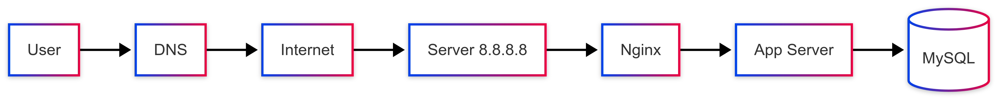
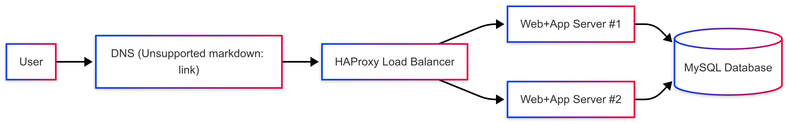
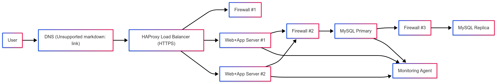
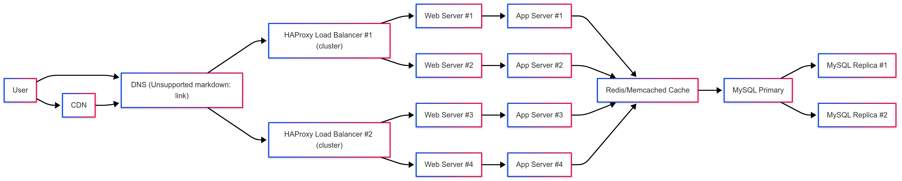

# Web Infrastructure Design — Holberton School

This project explains how to design and scale the infrastructure of a web application (**www.foobar.com**) step by step.  
Each task adds new components to improve **availability**, **security**, and **scalability**.

> ⚠️ The official task files (`0-…`, `1-…`, etc.) remain **without extension** and contain the raw Mermaid diagrams (for Holberton checker).  
> This README is here for **visual clarity** on GitHub, showing exported diagrams and summarizing each design.

---

## Task 0 — Simple Web Stack

**Description:**  
A single server hosts everything: web server (Nginx), application logic, and database.  

**Key points:**
- DNS record: `www.foobar.com → 8.8.8.8`
- Single server = SPOF (Single Point of Failure)
- Maintenance downtime required
- Limited scalability

**Diagram:**  

---

## Task 1 — Distributed Web Infrastructure

**Description:**  
Introduce a load balancer (HAProxy) to distribute requests between two web/app servers. Database runs on a separate server.  

**Key points:**
- Load balancing improves availability and scaling
- DB still a SPOF
- No HTTPS, no monitoring yet

**Diagram:**  

---

## Task 2 — Secured and Monitored Web Infrastructure

**Description:**  
Add security layers and monitoring to improve reliability.  

**Key points:**
- **HTTPS** (SSL/TLS termination at LB)
- **Firewalls**: restrict ports (80/443, 3306)
- **Monitoring agents**: collect QPS, errors, CPU/RAM
- **DB Replication**: Primary + Replica for redundancy
- Limitations: backend traffic not encrypted, only one writable DB

**Diagram:**  

---

## Task 3 — Scale Up

**Description:**  
Scale the system horizontally and split tiers.  

**Key points:**
- **2 Load Balancers in cluster (active-active)**
- Dedicated **Web tier** and **App tier**
- **Cache (Redis/Memcached)** reduces DB load
- **CDN** accelerates static content
- DB Primary + multiple replicas

**Diagram:**  

---

## Glossary

- **SPOF (Single Point of Failure):** if it fails, the whole service is down.  
- **LB (Load Balancer):** distributes traffic across servers.  
- **QPS (Queries Per Second):** metric to measure system load.  
- **LAMP stack:** Linux, Apache/Nginx, MySQL, PHP/Python/Node.  
- **Active-Active vs Active-Passive LB:** load sharing vs failover mode.  

---

## Notes

- The PNG diagrams are exported from the Mermaid code in each task file.  
- To edit them, copy the Mermaid block into [Mermaid Live Editor](https://mermaid.live), modify, and re-export.  
- This README is for **presentation**; the real grading is based on the task files.

